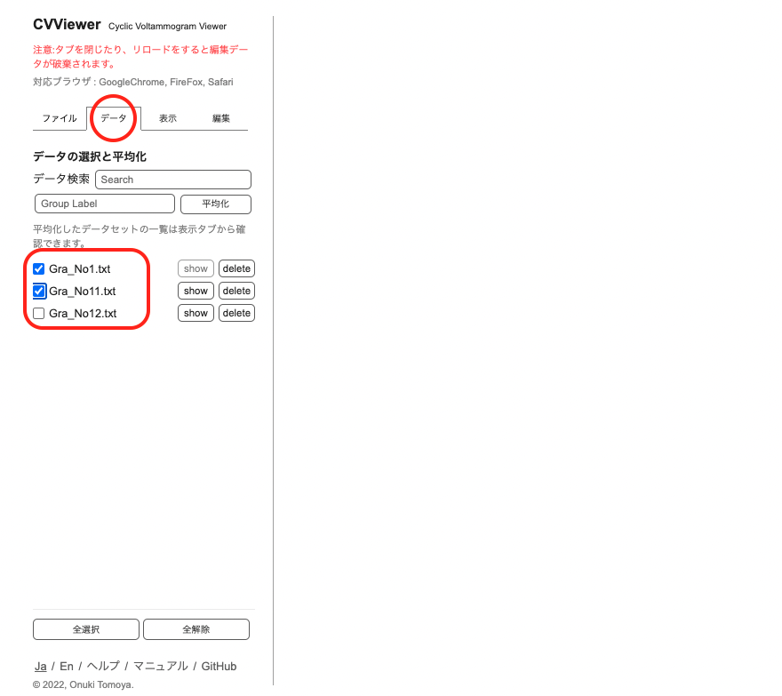
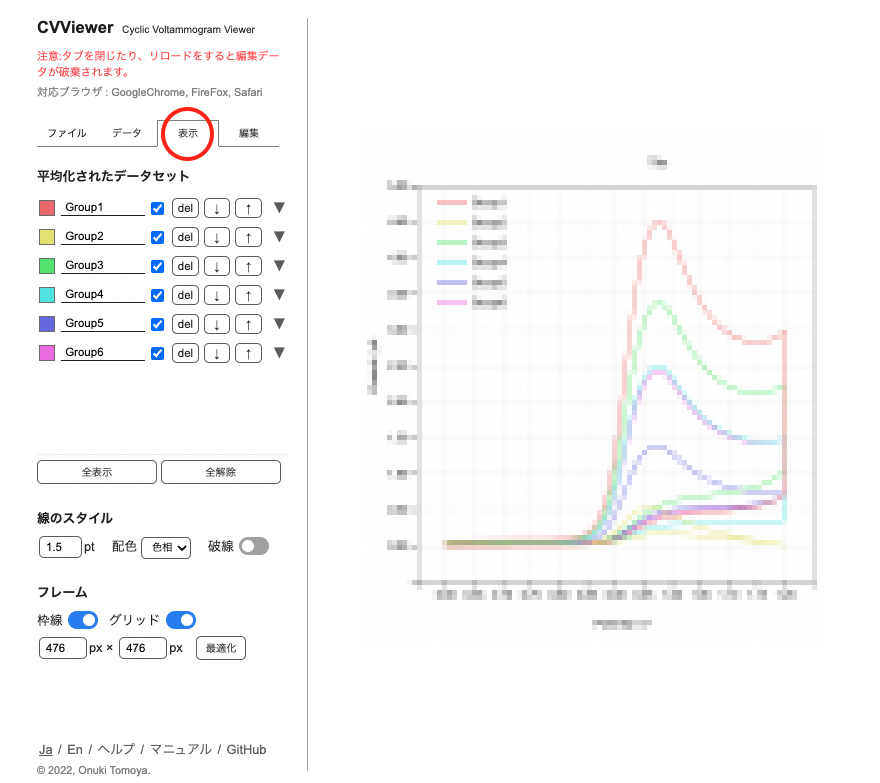
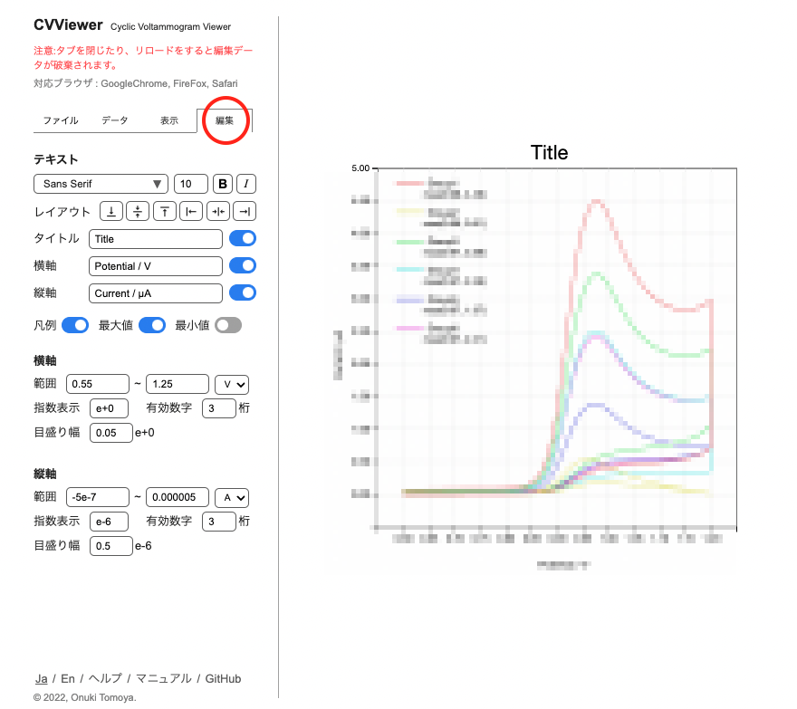

[Japanese](./README.md) / [English](./readme_en.md)

# CVViewer
2022.08.9  
小貫智弥  

- [CVViewer](#cvviewer)
  - [CVViewerとは](#cvviewerとは)
  - [使い方](#使い方)
    - [1. データの読み込み](#1-データの読み込み)
    - [2. データの平均化](#2-データの平均化)
    - [3. データセットの確認とグラフの編集](#3-データセットの確認とグラフの編集)
    - [4. グラフのデザイン](#4-グラフのデザイン)
    - [5. グラフを保存](#5-グラフを保存)
    - [6. グラフの再現・再編集](#6-グラフの再現再編集)
  - [ショートカットキー](#ショートカットキー)
  - [リリースノート](#リリースノート)
  - [参考文献](#参考文献)

<a href="https://tomoya-onuki.github.io/CVViewer/" target="_blank">https://tomoya-onuki.github.io/CVViewer/</a>

## CVViewerとは
サイクリックボルタンメトリー (cyclic voltammetry, CV) という電気化学計測によって得られたデータを可視化するためのツールです。サイクリックボルタンメトリーとは応答電流を測定する手法であり、電気化学分野において最も基本的かつ多用される測定法です。

## 使い方
### 1. データの読み込み
1. 「ファイルタブ」上で、ファイルをドロップして読み込みます

     

### 2. データの平均化
1. 「データタブ」上で平均を出したいデータのチェックボックスをチェックします。
3. 平均化ボタンを押します。このときラベルを設定することもできます。

   

1. グラフが表示されます

  

### 3. データセットの確認とグラフの編集
1. 「表示タブ」上で、平均化したデータセットを確認します。
2. このデータセットのラベルは1-3で指定したものと対応しています。指定しなかった場合は自動で名前がついています。テキストをクリックして編集できます。
3. テキストの左隣の黒い四角をクリックすると、グラフの色を設定できます
4. ▼ボタンを押すと、含まれているデータを確認できます
4. 線の太さや、自動配色機能による色付けなどを行います。
5. ピーク値やグリッドを必要に応じて表示/非表示します。

    

   *グラフにはモザイク処理をしています
   
  

### 4. グラフのデザイン
1. 「編集タブ」で行います
2. タイトルと各軸のラベルを設定します
3. グラフ上のテキストをクリックし、スタイル（フォント、サイズなど）を設定します
4. グラフ上のテキストをクリックし、レイアウトボタンやマウス・キーボード操作によって位置を調整します
5. 各軸の範囲を指定します。固有の単位あるいはパーセンテージによる調整ができます
6. 目盛りの指数表示形式や、有効数字を設定します
7. 目盛りの幅を設定します
  
   

  

### 5. グラフを保存
1. 「ファイルタブ」からグラフをダウンロードすることができます。
2. 画像で保存する場合はPNGを選択します。
3. 解像度を選択します。
4. ダウンロードボタンを押します。

  

### 6. グラフの再現・再編集
1. 「ファイルタブ」でjsonを選択し保存します。
2. 保存されたjsonファイル(.cvv.json)を「ファイルタブ」で読み込むとグラフが再現されます。

   

## ショートカットキー
| 操作 | windows | mac |
| :--- | :--- | :--- |
| 画像保存 | Alt + Shift + s | Option + Shift + s |
| json保存 | Alt + s | Option + s |
| タブ移動 | Alt + 1 ~ 4 | Option + 1 ~ 4 |
| サイズの最適化 | Alt + o | Option + o |
| 拡大 | Alt + + | Option + + |
| 縮小 | Alt + - | Option + - |
| グリッド | Alt + g | Option + g |
| 最大値 | Alt + m | Option + m |
| 最小値 | Alt + n | Option + n |
| 凡例 | Alt + l | Option + l |
| 枠線 | Alt + f | Option + f |

   

## リリースノート
- ver3.0 (2022/ 8/18) 
  - テキストのスタイルを編集できる
  - ラベルを移動できる
- ver2.1 (2022/ 8/16) 
  - ショートカットをつかえる
- ver2.0 (2022/ 8/16) 
  - 軸の指数表記と有効数字を設定できる
  - JSONファイルでの書き出したファイルを読み込むことで再編集できる
  - グラフの周囲の囲みを表示できる
  - 最大値と最小値の表示/非表示を独立に選択できる
  - ファイルを読み込むと自動的にデータタブへ移動する
- ver1.1 (2022/ 8/10) グラフの重ね順を変えることができる
- ver1.0 (2022/ 8/ 9) 基本機能

   

## 参考文献
1. https://ja.wikipedia.org/wiki/%E3%82%B5%E3%82%A4%E3%82%AF%E3%83%AA%E3%83%83%E3%82%AF%E3%83%9C%E3%83%AB%E3%82%BF%E3%83%B3%E3%83%A1%E3%83%88%E3%83%AA%E3%83%BC