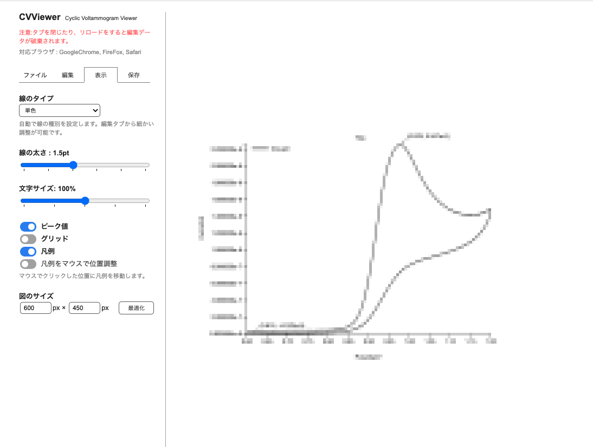

# CVViewer
2022.08.9  
小貫智弥  

https://tomoya-onuki.github.io/CVViewer/

[English](./readme_en.md)

## CVViewerとは
サイクリックボルタンメトリー (cyclic voltammetry, CV) という電気化学計測データを可視化するためのツールです。サイクリックボルタンメトリーとは応答電流を測定する手法であり、電気化学分野において最も基本的かつ多用される測定法です。

## 使い方
### 1.データの読み込みと平均化
1. 「ファイルタブ」上で、ファイルをドロップして読み込みます

     

2. 平均を出したいデータのチェックボックスをチェックします。
3. 平均化ボタンを押します。このときラベルを設定することもできます。

   

1. グラフが表示されます

  

### 2.データセットの確認とグラフの編集
1. 「編集タブ」上で、平均化したデータセットを確認します。
2. このデータセットのラベルは1-3で指定したものと対応しています。指定しなかった場合は自動で名前がついています。テキストをクリックして編集できます。
 
    

   *グラフにはモザイク処理をしています

3. テキストの左隣の黒い四角をクリックすると、グラフの色を設定できます

   

4. ▼ボタンを押すと、含まれているデータを確認できます
5. タイトルと各軸のラベルを設定します
6. 各軸の範囲を指定します
   
  

### 3.グラフのデザイン
1. 「表示タブ」で行います
2. 線のタイプを選びます。
3. ピーク値やグリッド、凡例を必要に応じて表示/非表示します。

   

  

### 4.グラフを保存
1. 「保存タブ」からグラフをダウンロードすることができます。(PNG形式)
  *再編集は不可能です

   

## リリースノート
- ver1.1 (2022/ 8/10) グラフの重ね順を変える機能を追加
- ver1.0 (2022/ 8/ 9) 基本機能

   

## 参考文献
1. https://ja.wikipedia.org/wiki/%E3%82%B5%E3%82%A4%E3%82%AF%E3%83%AA%E3%83%83%E3%82%AF%E3%83%9C%E3%83%AB%E3%82%BF%E3%83%B3%E3%83%A1%E3%83%88%E3%83%AA%E3%83%BC