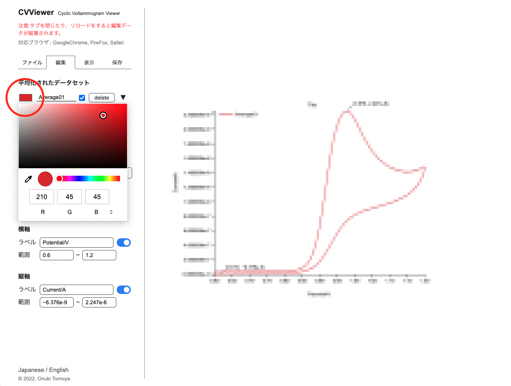

# CVViewer
2022.08.9  
小貫智弥  

## 使い方
### 1.データの読み込みと平均化
1. 「ファイルタブ」上で、ファイルをドラッグして読み込みます

2. 平均を出したいデータのチェックボックスをチェックします
3. 平均化ボタンを押します。このときラベルを設定することもできます。

4. グラフが表示されます

### 2.データセットの確認とグラフの編集
1. 「編集タブ」上で、平均化したデータセットを確認します。
2. このデータセットのラベルは1-3で指定したものと対応しています。指定しなかった場合は自動で名前がついています。テキストをクリックして編集できます。

*グラフにはモザイク処理をしています
1. テキストの左隣の黒い四角をクリックすると、グラフの色を設定できます

2. ▼ボタンを押すと、含まれているデータを確認できます
3. タイトルと各軸のラベルを設定します
4. 各軸の範囲を指定します
   
### 3.グラフのデザイン
1. 「表示タブ」で行います
2. 線のタイプを選びます。
3. ピーク値やグリッド、凡例を必要に応じて表示/非表示します。

### 4.グラフを保存
1. 「保存タブ」からグラフをダウンロードすることができます。(PNG形式)
  *再編集は不可能です