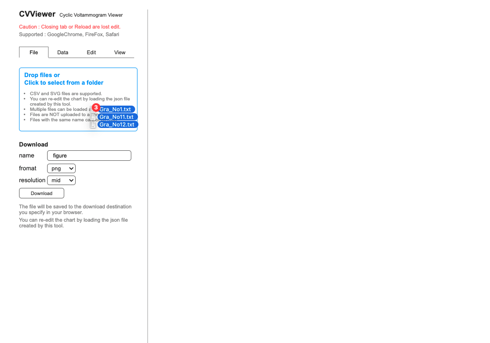
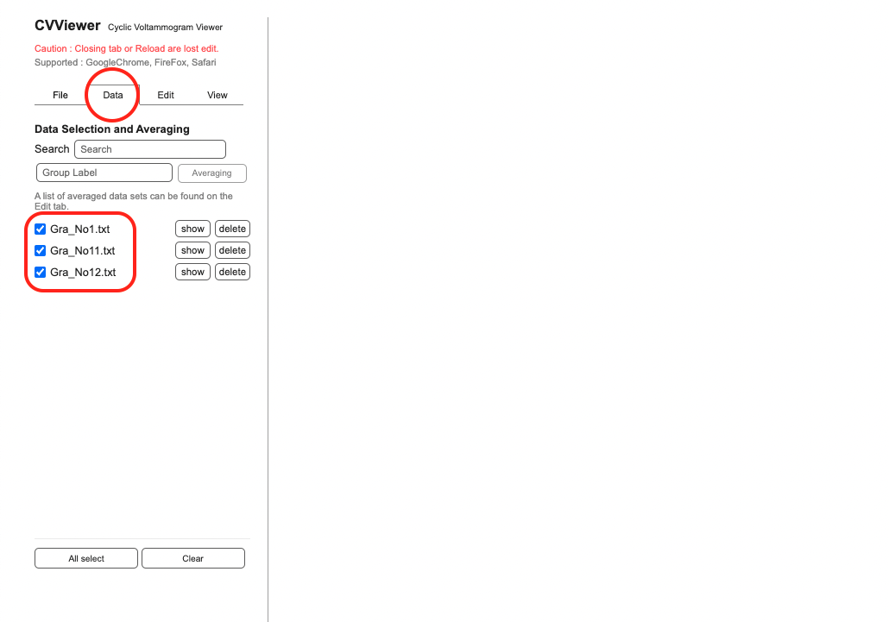
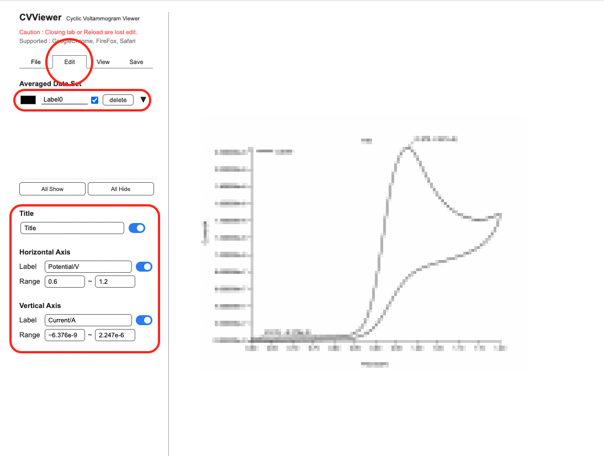
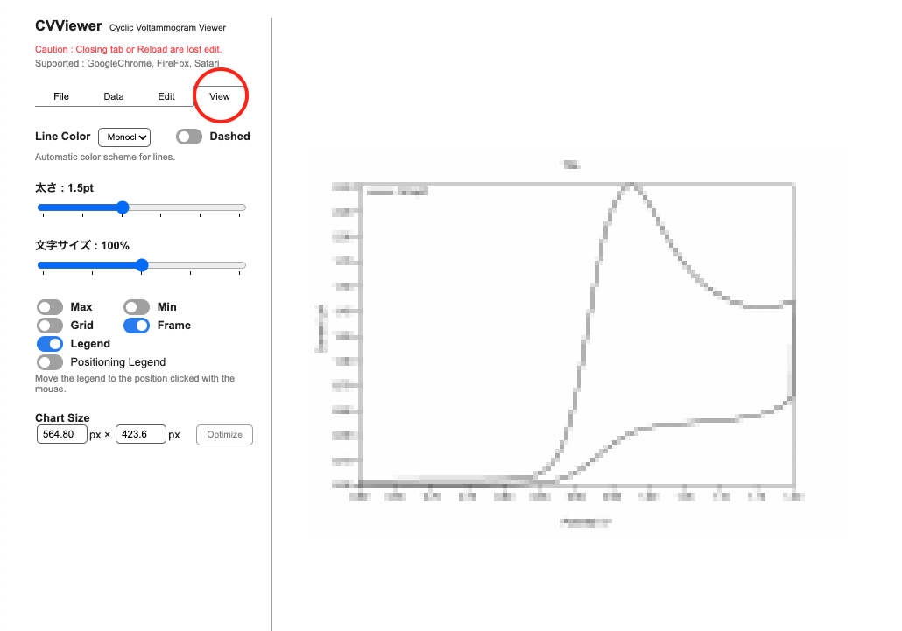

[Japanese](./README.md) / [English](./readme_en.md)

# CVViewer
2022.08.10  
Tomoya Onuki  

- [CVViewer](#cvviewer)
  - [Introduction](#introduction)
  - [Usage](#usage)
    - [1. Loading Data](#1-loading-data)
    - [2. Averaging](#2-averaging)
    - [3. Datasets and Edit Chart](#3-datasets-and-edit-chart)
    - [4. Chart Design](#4-chart-design)
    - [5. Donwload Chart](#5-donwload-chart)
    - [6. Re-edit Chart](#6-re-edit-chart)
  - [Short cut key](#short-cut-key)
  - [Release Note](#release-note)
  - [Reference](#reference)

<a href="https://tomoya-onuki.github.io/CVViewer/en/" target="_blank">https://tomoya-onuki.github.io/CVViewer/en/</a>

Translated by [deepl.com](https://www.deepl.com/)

## Introduction
A tool for visualizing electrochemical measurement data called cyclic voltammetry (CV). Cyclic voltammetry is a technique for measuring response current, and is the most basic and frequently used measurement method in the field of electrochemistry.

## Usage
### 1. Loading Data
1. In "File" tab, Drop files or Click to select from folder.
  
     

### 2. Averaging
1. In "Data" tab, Tick check boxs to average.
2. Click to "Averaging" button. Be able to set labels.

   

3. The chart are displayed. 

  

### 3. Datasets and Edit Chart
1. In "Edit" tab, check averaged datasets.
2. Labels of datasets ware setted in 1-3. Label ware setted automaticaly, when you did't set labels. You are abele to edit label to click text form.
3. Click the black rectangl to set up line color.
4. Click "▼", to check data that are concluded in a dataset.
5. Set labels of title and axes.
6. Set ranges of axes
  
   
   
   *Graphs are mosaicked.

     

### 4. Chart Design
1. In "View" tab.
2. Select line type.
3. If necessary, Show / hide peak values, grid line and legend.

   

  

### 5. Donwload Chart
1. you can download the graph from the "File tab".
2. select PNG to save as an image.
3. Select the resolution.
4. Press the "Download" button.

  

### 6. Re-edit Chart
Select and save the json file in the "File tab". 2.
Load the saved json file (.cvv.json) in the "File tab" to reproduce the graph.

   

## Short cut key
| Function | windows | mac |
| :--- | :--- | :--- |
| Download Image (png) | Alt + Shift + s | Option + Shift + s |
| Download JSON | Alt + s | Option + s |
| Move Tab | Alt + 1 ~ 4 | Option + 1 ~ 4 |
| Optimize chart size | Alt + o | Option + o |
| Zoom in | Alt + + | Option + + |
| Zoom out | Alt + - | Option + - |
| Show / Hide Grid | Alt + g | Option + g |
| Show / Hide Max value | Alt + m | Option + m |
| Show / Hide Minimu Value | Alt + n | Option + n |
| Show / Hide Legend | Alt + l | Option + l |
| Show / Hide Frame | Alt + f | Option + f |

   

## Release Note
- ver2.0 (2022/ 8/16) 
  - Short cut key.
  - Can set index notation and significant figures for axes.
  - Re-editing can be done by reading the exported JSON file.
  - Display of surroundings around graphs.
  - Independently selectable display/non-display of maximum and minimum values.
  - Automatic navigation to the Data tab when a file is read in tool.
- ver1.1 (2022/ 8/10) Users can change the order of overlaying charts.
- ver1.0 (2022/ 8/ 9) Basic

   

## Reference
1. https://ja.wikipedia.org/wiki/%E3%82%B5%E3%82%A4%E3%82%AF%E3%83%AA%E3%83%83%E3%82%AF%E3%83%9C%E3%83%AB%E3%82%BF%E3%83%B3%E3%83%A1%E3%83%88%E3%83%AA%E3%83%BC