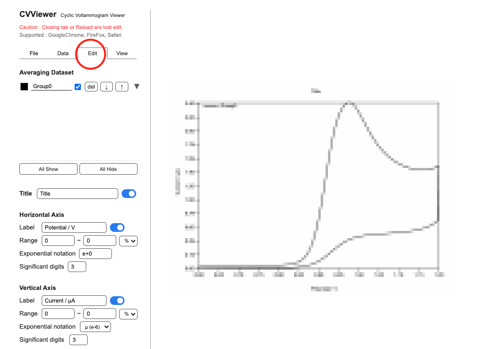

# CVViewer
2022.08.10  
Tomoya Onuki  

https://tomoya-onuki.github.io/CVViewer/en/

[Japanese](./README.md)

## Usage
### 1.Loading Data and Averaging
1. In "File" tab, Drop files or Click to select from folder.
  
     

1. Tick check boxs to average.
2. Click to "Averaging" button. Be able to set labels.

   

3. The chart are displayed. 

  

### 2.Datasets and Edit Chart
1. In "Edit" tab, check averaged datasets.
2. Labels of datasets ware setted in 1-3. Label ware setted automaticaly, when you did't set labels. You are abele to edit label to click text form.
  
   
   
   *Graphs are mosaicked.

1. Click the black rectangl to set up line color.
  
   

2. Click "▼", to check data that are concluded in a dataset.
3. Set labels of title and axes.
4. Set ranges of axes

     

### 3.Chart Design
1. In "View" tab.
2. Select line type.
3. If necessary, Show / hide peak values, grid line and legend.

   

  

### 4.Donwload chart
1. In "Save" tab, you download a chart. The format is PNG.
  *You can not re-edit the chart.

   

## Release Note.
### ver1.0 (2022/8/10)