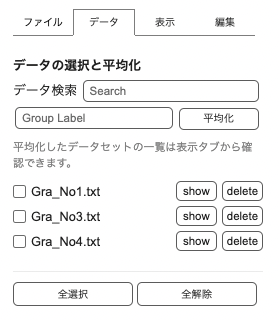

[Japanese](./README.md) / [English](./readme_en.md)

<a href="https://tomoya-onuki.github.io/CVViewer/en/" target="_blank">https://tomoya-onuki.github.io/CVViewer/en/</a>

# CVViewer
2022.08.10  
Update : 2022.08.23
Tomoya Onuki  

- [CVViewer](#cvviewer)
  - [Introduction](#introduction)
  - [Usage](#usage)
    - [1. Loading Data](#1-loading-data)
    - [2. Averaging](#2-averaging)
    - [3. Datasets and Edit Chart](#3-datasets-and-edit-chart)
    - [4. Chart Design](#4-chart-design)
    - [5. Donwload Chart](#5-donwload-chart)
    - [6. Re-edit Chart](#6-re-edit-chart)
    - [Loading Files](#loading-files)
    - [1. Drop](#1-drop)
    - [2. Click](#2-click)
    - [3. ショートカット](#3-ショートカット)
  - [Data Processing](#data-processing)
    - [1. Data Averaging](#1-data-averaging)
    - [2. Specifying a Label for a Data Set](#2-specifying-a-label-for-a-data-set)
    - [3. Data Search](#3-data-search)
    - [4. Batch selection](#4-batch-selection)
  - [Visualization of Data Sets](#visualization-of-data-sets)
    - [1. Toggle Show/Hide](#1-toggle-showhide)
    - [2. Changing labels](#2-changing-labels)
    - [3. Changing Colors](#3-changing-colors)
    - [4. Confirmation of details](#4-confirmation-of-details)
    - [5. Changing the stacking order](#5-changing-the-stacking-order)
  - [Design](#design)
    - [1. Line Style](#1-line-style)
    - [2. Overall graph style](#2-overall-graph-style)
  - [Edit Label](#edit-label)
    - [1. Edit Text](#1-edit-text)
    - [2. Legend](#2-legend)
    - [3. Specifying the font](#3-specifying-the-font)
    - [4. Position](#4-position)
  - [Edit Axis](#edit-axis)
    - [1. Range](#1-range)
    - [2. Format](#2-format)
    - [3. Scale](#3-scale)
  - [Download a graph](#download-a-graph)
    - [1. Image data (PNG format)](#1-image-data-png-format)
    - [2. JSON Data](#2-json-data)
  - [Short cut key](#short-cut-key)
  - [Release Note](#release-note)
  - [Reference](#reference)

Translated by [deepl.com](https://www.deepl.com/)

## Introduction
A tool for visualizing electrochemical measurement data called cyclic voltammetry (CV). Cyclic voltammetry is a technique for measuring response current, and is the most basic and frequently used measurement method in the field of electrochemistry.

## Usage
### 1. Loading Data
1. In "File" tab, Drop files or Click to select from folder.
  
     

### 2. Averaging
1. In "Data" tab, Tick check boxs to average.
2. Click to "Averaging" button. Be able to set labels.

   

3. The chart are displayed. 

  

### 3. Datasets and Edit Chart
1. In "Edit" tab, check averaged datasets.
2. Labels of datasets ware setted in 1-3. Label ware setted automaticaly, when you did't set labels. You are abele to edit label to click text form.
3. Click the black rectangl to set up line color.
4. Click "▼", to check data that are concluded in a dataset.
5. Set labels of title and axes.
6. Set ranges of axes
  
   
   
   *Graphs are mosaicked.

     

### 4. Chart Design
1. In "View" tab.
2. Select line type.
3. If necessary, Show / hide peak values, grid line and legend.

   

  

### 5. Donwload Chart
1. you can download the graph from the "File tab".
2. select PNG to save as an image.
3. Select the resolution.
4. Press the "Download" button.

  

### 6. Re-edit Chart
Select and save the json file in the "File tab". 2.
Load the saved json file (.cvv.json) in the "File tab" to reproduce the graph.

   

### Loading Files

Two types of files can be read: measurement data and JSON data created with this tool.

The only supported measurement data are text files (.txt) that have been measured and exported by ALS Electrochemical Analyzer Model 800D (BAS).。
 

### 1. Drop
Drop the file within the border of the image. As you bring the mouse over it, the border will be highlighted in blue, and the drop is completed by releasing the mouse.  

 

### 2. Click
Click on the border of the image. The file selector will then open.  

 

### 3. ショートカット
A shortcut (`alt+O`(win), `opt+shift+O`(max)) opens a file selector, so select the file.

   

## Data Processing
This function primarily averages the data.
A graph is also created at the time of averaging.

### 1. Data Averaging
This function creates a data set averaging multiple data.
Check the checkbox to the left of the file name you wish to average and press the `Average` button to generate an averaged data set.

The data set can be viewed from the View tab.  

 

### 2. Specifying a Label for a Data Set
By entering a label name in the box labeled "Group Label," you can specify the label for the dataset to be created by averaging.
 

### 3. Data Search
Enter a keyword in the search window to search for files containing that keyword.

### 4. Batch selection
You can select or deselect all data in a batch by pressing `Select All` or `Deselect All` at the bottom. This function can be used in conjunction with the data search function to improve efficiency.

   

## Visualization of Data Sets
Data is averaged and a graph is generated when the data is averaged.

 

### 1. Toggle Show/Hide
You can hide labels on the graph by unchecking the checkbox to the right of the label.
You can change them all at once by pressing `Select All` or `Deselect All` at the bottom.

 

### 2. Changing labels
Click on the label section to enter edit mode. You can edit the name.

 
  
### 3. Changing Colors
Click on the black square to the left of the label to display the color palette. Specify a color to change the color on the graph.

 
  
### 4. Confirmation of details
Click on the `▼` button to view the files included in the data set.

 
  
### 5. Changing the stacking order
The stacking order in the graph is the same as the order from the top of the dataset list. You can change the order by pressing the `↓` and `↑` buttons. You can also reverse the order by pressing the `↓↑` buttons at the bottom.

 
  

   

## Design
### 1. Line Style
- You can specify the thickness of the lines.
- If you select a color scheme, the color scheme will be automatically applied.
- When dashed lines are turned on, classification is automatically performed with dashed lines.
 

### 2. Overall graph style
- Show/hide borders
- Show/hide the grid
- The size of the grid can be specified. However, it is impossible to make it larger than the window size.
- Click the `Optimize` button to optimize the size. It will not be vertical.
- You can specify the margins.

   

## Edit Label
### 1. Edit Text
- You can specify the content of the title, horizontal axis, and vertical axis labels
- You can specify whether to show or hide them.

### 2. Legend
- You can specify whether to show or hide the legend.
- Maximum and minimum can be shown/hidden.

### 3. Specifying the font
- Click on the label you wish to edit on the graph and a blue border will appear. In this state, you can edit the style of the label from the Edit tab.
- You can set font, size, bold, and italic.

### 4. Position
- With a label selected, drag the mouse to move the label.
- With the label selected, press the arrow keys to move the label.
- Press the Layout button to adjust the position.

   

## Edit Axis
### 1. Range
- You can specify the range of an axis.
- There are two modes: units mode and percentage mode.
- In percentage mode, you can specify the initial display width as a percentage of 100%.

### 2. Format
- Can specify exponent display
- Can specify the number of significant digits after the decimal point

### 3. Scale
- Specify the scale width, which is set with respect to 0.
- The direction (inside/outside) and display/non-display of the scale can be specified.

   

## Download a graph
You can save a graph in two formats.

### 1. Image data (PNG format)
- Save in png format.
- Suitable for use as charts.
- Cannot be re-edited.
- You can specify the resolution. Medium is recommended.

### 2. JSON Data
- Format for re-editing.
- The graph can be reproduced by loading it into this tool. It can also be re-edited.
- It cannot be used as a chart.
- To convert it to an image, read it once with this tool and then download it in png format.

   

## Short cut key
| Function | windows | mac |
| :--- | :--- | :--- |
| Loading File | Alt + o | Option + o |
| Download Image (png) | Alt + Shift + s | Option + Shift + s |
| Download JSON | Alt + s | Option + s |
| Move Tab | Alt +  ←,→ | Option + ←,→ |
|  | Alt + 1 ~ 4 | Option + 1 ~ 4 |
| Optimize chart size | Alt + 0 | Option + 0 |
| Zoom in | Alt + + | Option + + |
| Zoom out | Alt + - | Option + - |
| Show / Hide Grid | Alt + g | Option + g |
| Show / Hide Max value | Alt + m | Option + m |
| Show / Hide Minimu Value | Alt + n | Option + n |
| Show / Hide Legend | Alt + l | Option + l |
| Show / Hide Frame | Alt + f | Option + f |

   

## Release Note
- ver2.0 (2022/ 8/16) 
  - Short cut key.
  - Can set index notation and significant figures for axes.
  - Re-editing can be done by reading the exported JSON file.
  - Display of surroundings around graphs.
  - Independently selectable display/non-display of maximum and minimum values.
  - Automatic navigation to the Data tab when a file is read in tool.
- ver1.1 (2022/ 8/10) Users can change the order of overlaying charts.
- ver1.0 (2022/ 8/ 9) Basic

   

## Reference
1. https://ja.wikipedia.org/wiki/%E3%82%B5%E3%82%A4%E3%82%AF%E3%83%AA%E3%83%83%E3%82%AF%E3%83%9C%E3%83%AB%E3%82%BF%E3%83%B3%E3%83%A1%E3%83%88%E3%83%AA%E3%83%BC